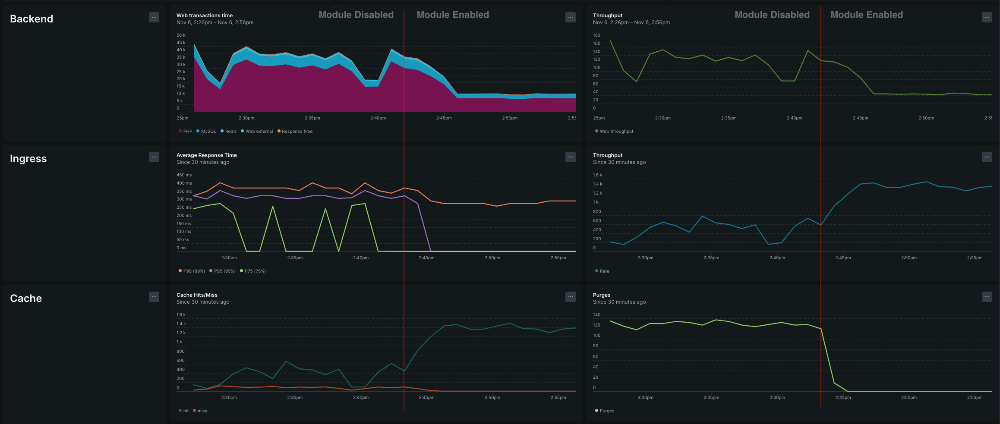

# SamJUK_CacheDebounce

[](https://github.com/SamJUK/m2-module-cache-debounce/actions/workflows/ci.yml) [](https://github.com/SamJUK/m2-module-cache-debounce/releases)

This module debounces/defers/delays FPC cache purge requests to occur on a set schedule. Allowing you to make a trade off between cache accuracy and backend load.

Particularly useful for a ERP solutions that like to issue significant stock updates, in turn flushing cache regularly especially for common parent categories.

If you require a more aggressive solution, such as disabling Cache Flushes entirely then [Hypershop_SpikePerformance](https://github.com/hypershopbv/Hypershop_SpikePerformance) might be a better solution for you.


## Proof Of Concept

The module was tested on a fresh Luma store with Sample Data, running on CPX31 VPS (4vCPU, 8GB Memory). 

Traffic was generated via a golang based sitemap crawler running back to back.

A stock management integration was mocked by, setting a random QTY on a random Sku every 1 second via the PUT StockItems route.




## Installation
```sh
composer config repositories.samjuk-m2-module-cache-debounce vcs git@github.com:SamJUK/m2-module-cache-debounce.git
composer require samjuk/m2-module-cache-debounce:@dev
php bin/magento setup:upgrade && php bin/magento cache:flush
```

## Configuration
Configuration can be handled via System configuration, from within the Cache Debounce menu of the SamJUK Tab.

Or can be set via the CLI with the command 
```sh
php bin/magento config:set <path> <value>
```

Option | Config Path | Default | Description
--- | --- | --- | ---
Enabled | `samjuk_cache_debounce/general/enabled` | `0` | Feature flag to toggle functionality of the module
Flush Schedule | `samjuk_cache_debounce/cron/flush_schedule` | `*/5 0 0 0 0` | Cron schedule to run the scheduled flush

## Will this help my store?

The performance improvement comes from improving cache performance by reducing the amount of cache purge requests in turn reducing system load.

To check how many cache invalidations your system is issuing, you can enable debug logging, which will add some `cache invalidate` entries to your `var/log/debug.log` file. 

```sh
php bin/magento setup:config:set --enable-debug-logging=true && php bin/magento cache:flush
```

If you do not want to enabling debug logging in production for some reason, maybe log ingest limitations. You can patch the invalidation logger to change the log level to `info`, so they appear within the `system.log` file.

```diff
--- vendor/magento/framework/Cache/InvalidateLogger.php
+++ vendor/magento/framework/Cache/InvalidateLogger.php
@@ -43,7 +43,7 @@
      */
     public function execute($invalidateInfo)
     {
-        $this->logger->debug('cache_invalidate: ', $this->makeParams($invalidateInfo));
+        $this->logger->info('cache_invalidate: ', $this->makeParams($invalidateInfo));
     }

     /**

```
